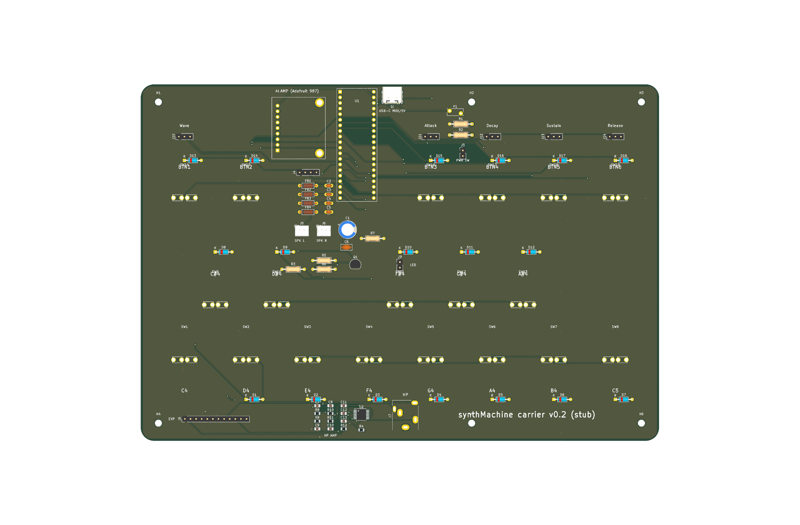

# synthMachine carrier board (KiCad 9 stub)

A starting point for a PCB that sits under your button panel and carries the
Daisy Seed, the 19 arcade buttons (13 keys + 6 spare), headers for the 5
panel-mount pots, USB-C for MIDI and power, a TPA6138A2 headphone amp and jack,
and the Adafruit MAX98306 amp breakout feeding the two enclosed Adafruit speakers.

Everything here is generated by `gen_kicad.py` so the schematic and the PCB
always agree with each other and with the pin map in `../synthMachine.cpp`.



## Open it

Open `synth_machine.kicad_pro` in KiCad 9. The schematic passes ERC with zero
violations. The PCB is placed **and autorouted** (Freerouting, 2 layers, zero
unrouted connections) with GND pours on both sides. Remaining DRC items: four
hole-clearance nits inside KiCad's own USB-C footprint and two "starved thermal"
notes on header pads that already have 2 to 3 spokes. Both can be ignored.

## Regenerate

```bash
/Applications/KiCad/KiCad.app/Contents/Frameworks/Python.framework/Versions/Current/bin/python3 hardware/gen_kicad.py
```

Edit the netlist / placements at the top of the script and re-run, or just
edit the KiCad files directly once you are happy with the structure. The
generator overwrites the `.kicad_sch` and `.kicad_pcb`, so pick one workflow.

## Routing

```bash
KICAD_PY=/Applications/KiCad/KiCad.app/Contents/Frameworks/Python.framework/Versions/Current/bin/python3
$KICAD_PY hardware/route.py --java <java25>/bin/java --jar freerouting-2.4.1.jar
$KICAD_PY hardware/route.py --pours-only     # rebuild just the GND pours
```

`route.py` strips tracks and pours, exports a Specctra DSN, runs Freerouting
headless, imports the session, then re-adds and fills the GND pours. Net
classes (set in `gen_kicad.py`): 0.25 mm default, 0.6 mm "Power" for +5V and
the speaker lines, 0.4 mm "USB_Power" for VBUS so it can escape the USB-C pads.
GND and the 3V3 rails use the default width; the pours carry their current.
Freerouting needs Java 25; a portable JRE from adoptium.net works without
installing anything.

The autorouter does not know audio from scan lines, so before ordering it is
worth a manual pass on the short AUDIO_L/R and HP_* runs (keep them away from
the USB pair and the matrix columns) and on the +5V feed to the amp header.

## Geometry

The board outline is your panel drawing: 234.95 x 161.925 mm, R6 corners.
Button centres are derived from the drawing's dimensions (8 mm side margins,
25 mm bottom margin, 1.4 mm between the white and black rows, 25 mm between the
black and top rows, pots 12.5 mm above the top row), so the PCB stacks straight
under the panel.

Each button plugs into two **Keystone 3534** vertical quick-fit receptacles
(0.110" tabs, 8 mm tall, two 1.65 mm legs on 3.7 mm pitch). With the tab tips
27.5 mm below the flange and 5 mm of insertion, the PCB top surface lands about
**31 mm below the panel underside**. That is why the pots, the LED, and the power
switch are wired panel-mount parts on headers rather than board-mounted.

## What is on the board

| Block | Parts | Notes |
|---|---|---|
| Daisy Seed | U1 on 2x 1x20 sockets | In the gap between the top-row buttons, USB end at the top edge so the case can have a cutout for the Seed's own micro-USB (programming). |
| Keys | SW1..SW13 + D1..D12 (1N4148) | Bottom row white keys, middle row black keys. Columns D4..D9 driven low, rows D1..D3 with pull-ups, exactly as `scanButtonMatrix()`. C4 is direct on D10. |
| Spare buttons | SW14..SW19 + D13..D18 | Top row, on the 6 unused matrix slots: (c0 r0) (c0 r1) (c1 r0) (c2 r0) (c3 r0) (c4 r0). They are the `-1` entries in `NOTE_MAPPING`. |
| Pots | J10..J14, 1x3 headers at the panel's O7 holes | 1 = +3V3A, 2 = wiper to A0..A4, 3 = AGND. Use 10k linear panel-mount pots. |
| USB-C | J1 (GCT USB4105), R1/R2 5k1, F1 2A polyfuse | Data to D30/D29 = Daisy "external" USB, firmware must use `MidiUsbTransport::Config::EXTERNAL`. VBUS is the only power input. |
| Power | F1 -> J3 panel switch -> +5V; C1 470u, C6 100n | 5 V rail feeds Seed VIN and the amp. |
| Amp | A1 = Adafruit #987 on a 1x9 header | Pin 1 = G ... 9 = VDD (from Adafruit's Eagle file). Inputs single-ended from the Seed line out, L-/R- to GND. |
| Speakers | J4 1x4 header, FB1..FB4 + C2..C5, J5/J6 JST-PH | Amp outputs exist only on the breakout's screw terminals, so 4 short wires go to J4. Each line then passes a ferrite bead with 220 pF to ground (the MAX98306 datasheet EMI filter) before the JST-PH speaker plugs. |
| Headphone amp | U2 TI TPA6138A2PWR (TSSOP-14), C7/C8 1u in, R8..R11 10k, C9/C10 47p, C11/C12 1u charge pump, C13 2u2, R12 100k | DirectPath amp: ground-centred output, no output caps, 40 mW into 32 ohm from the Seed's 3V3 rail. Inverting stage, gain -1 (change R9/R11 for more). All passives 0805. Mute is active-low, pulled up by R12; D14 (HP_MUTE) can mute it. DigiKey 296-28248-1-ND, about $0.75. |
| Headphone jack | J7 3.5 mm switched jack (CUI SJ1-3515N), R3 100k, R4 10k, R5/R6 10k, Q1 2N3904 | Tip/ring from U2. The jack's normally-closed TN contact is the plug detect: held near 0 V by the amp output (and R4) with nothing inserted, pulled to 3V3 when a plug opens it. Q1 then pulls the speaker amp's SD low, muting the speakers. D11 (MUTE) can do the same from firmware, D13 reads HP_DET. |
| LED | R7 1k from D12, J9 header | Wired 3 mm panel LED in the small hole above the E/F gap. |
| Expansion | J8 1x12 | HP_MUTE, D26, D27, A5..A8, HP_DET, MUTE, 3V3, 5V, GND. |
| Mounting | H1..H6 M3 | Corner holes 8 mm in from the edges plus two mid-span. Match these to your enclosure. |

## About "caps for the speakers" and the shared amp

The MAX98306 outputs are bridge-tied class-D: each speaker sits between a + and
a - output with no ground reference. Two things follow:

- **No series capacitors on the speakers.** A BTL output has no DC across the
  load, and a cap would only add a high-pass and a current path problem. The
  caps that belong here are the supply bulk/decoupling (C1, C6) and the 220 pF
  EMI filter caps to ground after the ferrite beads (C2..C5). That is what the
  board has.
- **Headphones cannot share the amp.** A headphone's sleeve is common to both
  channels and sits at ground; connecting it to L-/R- would tie the two bridges
  together (Adafruit warns this damages the amp), and driving a headphone from
  L+ to ground puts the 360 kHz PWM carrier and a DC offset through it. So the
  headphone jack takes the Seed's line out directly, and the jack's switch
  contact mutes the speaker amp. Functionally that is what you asked for: plug
  in and the speakers go quiet, unplug and they come back. The headphones get
  their own amp (U2, TPA6138A2) fed from the same line out, so level is not a
  problem: the Seed's 1 Vrms at unity gain is about 30 mW into 32 ohm, right at
  the chip's rating. Raise R9/R11 (e.g. 30k with R8/R10 = 15k for gain 2) if you
  use high-impedance headphones.

## Things to verify before ordering

1. **Button tab pitch.** Measured 9.05 mm outer-edge to outer-edge with 2.8 mm
   tabs, so `TAB_PITCH` is 6.25 mm centre-to-centre. Check one button against
   a printed 1:1 footprint before ordering; the receptacles have no slack.
2. **Seed pin-1 corner** on `DaisySeed_2x20`, and the **amp header's pin-1 end**
   on `Adafruit_MAX98306_Breakout` (silkscreen on the breakout: G/G' at one end,
   VDD at the other).
3. **Detect polarity.** HP_DET is held low through the jack's TN contact by the
   headphone amp's output (0 V DC) and R4. If U2 is muted its output floats and
   R4 alone holds it; check with a meter before trusting the auto-mute.
4. **USB power budget.** Two 4 ohm speakers at full tilt can draw more than a
   USB-A port's 500 mA. A USB-C supply or a 1.5 A-capable port is fine; a laptop
   USB-A port will brown out at high volume.
5. Standoff height between panel and PCB (about 31 mm, see Geometry).

## Next steps

- Decide whether to keep the breakout or put the MAX98306 (TDFN-14) straight on
  the board; that would put the speaker outputs on the PCB and drop J4.
- Firmware: enable `EXTERNAL` USB MIDI, map BTN1..6, read HP_DET on D13, drive
  the LED on D12, optionally drive HP_MUTE (D14) low during boot for silence.
- The headphone amp section is the only SMD on the board (TSSOP-14 + 0805s);
  everything else is through-hole.
- Bill of materials: `File > Fabrication Outputs > BOM` in the schematic editor.
  Remember 2x Keystone 3534 per button (38 total) since they live inside the
  button footprint rather than as separate schematic parts.
