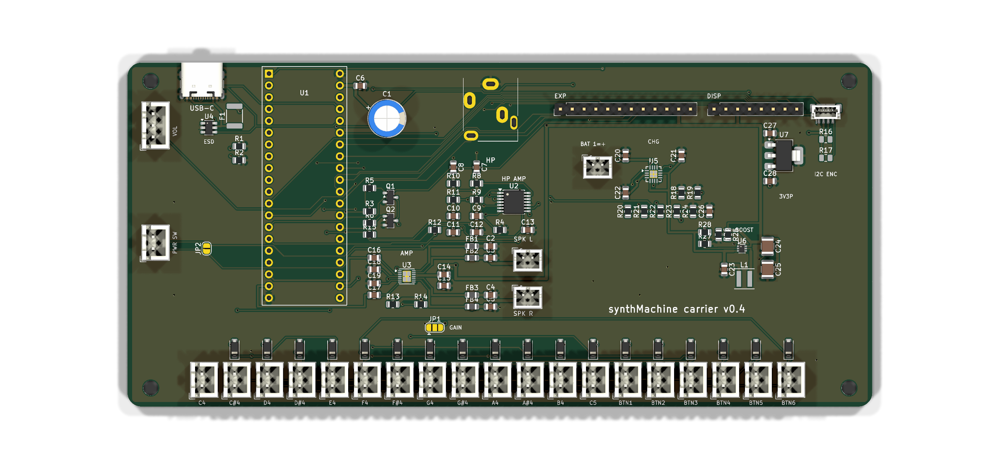

# synthMachine carrier board v0.4

Second revision of the carrier. v0.3 in `../v0.3/` is the board that was
fabricated in September 2026; v0.4 applies everything in `../NEXT_REVISION.md`
and adds onboard battery power. It is a new outline: 160 x 74 mm landscape
instead of 100 x 100, with all 19 key headers in one row along the bottom
edge in panel order. The USB-C, the Seed's own USB and the headphone jack
still share the top edge.



| Change | Parts | Why |
|---|---|---|
| One row of key headers | K1..K19 along the bottom at 7 mm pitch, diode above each, name below | Every button lead is the same length and points the same way. The headers are rotated so the row is 132 mm wide and the corners stay free for mounting holes. |
| Battery power | J17 JST-PH cell, U5 BQ24074 charger with power path, U6 TPS61023 5 V boost, J16 power-switch header, JP2 always-on jumper | Runs from a single LiPo, charges from the USB-C, and runs from USB while charging. See the power section below. |
| Plug detect reaches 3V3 | Q1 is a 2N7002 MOSFET | The v0.3 BJT clamped HP_DET at 0.8 V so D13 never saw a plug. No jumper, no `HP_DET=adc`. |
| Firmware mute on its own transistor | Q2 2N7002, R6 gate, R15 pull-up; MUTE on D0 | Muted at reset, in DFU and after a crash; firmware drives D0 low to run. Wired-OR with Q1. |
| I2C for encoders | J15 STEMMA QT (top-entry) on I2C1 (D11 SCL, D12 SDA) at the top right; R16/R17 pull-ups DNP | For the seesaw rotary-encoder breakouts; the cable leaves upward toward the panel. |
| Display header | J9: GND, 3V3, 5V, SCK (A7), MOSI (A3), NSS (A8), D/C (D26), RST (D27) | Hardware SPI1 for an OLED or a Sharp memory LCD. |
| Encoders instead of bank pots | J11..J14 removed; only J10 (volume) remains | The four bank controls are seesaw rotary encoders on J15. Their old ADC pins go to the expansion header. |
| USB ESD, SMD fuse | U4 USBLC6-2SC6, F1 1812 PTC on the USB input | Data lines were unprotected; the radial fuse collided with the Seed. |
| Peripheral 3.3 V rail | U7 AP7361C-33 (SOT-223, 1 A) from +5V, C27/C28 | Feeds the encoders, the display and the expansion header's 3V3 pin, so the Seed's regulator carries only the Seed, the headphone amp and pull-ups. |
| Assembly-ready BOM | every part has an MPN or LCSC number | `fab.sh` writes `pcbway_bom.csv` / `pcbway_cpl.csv`. |

Only the volume pot header remains (A0). The four bank controls are I2C
rotary encoders on J15, chained over STEMMA QT. The firmware profile
`HW=carrier4` reads A0 only and leaves the bank inputs alone until the
encoder support exists.

## Power

```
USB-C J1 -> F1 2.5 A PTC -> VUSB -> U5 BQ24074 IN
                                    U5 BAT  <-> J17 cell (+ C22)
                                    U5 OUT   -> VSYS (4.4 V on USB, else the cell)
VSYS -> L1 1 uH / U6 TPS61023 -> +5V (5.1 V) -> Seed VIN, speaker amp, J8/J9 5V pins
                                       +5V -> U7 AP7361C-33 -> 3V3P -> J15 encoders, J9 display, J8 3V3
```

- **Charger.** EN2 high and EN1 low select the resistor-programmed input
  limit: R19 1.1k gives 1.5 A, and the charger's input-voltage loop backs off
  automatically on a weak USB port. R18 1.8k sets 0.5 A fast charge, which is
  0.25 C for a 2000 mAh cell and keeps the linear charger under 0.7 W. TMR and
  ITERM are left open for the default 30 min / 5 h safety timers and 10 %
  termination. CE is tied low, TS has the 10k that the part needs when there
  is no pack thermistor. The system runs from OUT while the cell charges, and
  the cell supplements USB on peaks.
- **Boost.** The TPS61023 makes 5.1 V from VSYS (750k/100k on a 0.6 V
  reference). It carries the whole load on USB as well as on battery, which is
  fine: from the charger's 4.4 V it is barely working. From a 3.3 V cell it
  delivers about 1.5 A continuous with the 470 uF C1 covering the amp's
  peaks. Inductor per TI's table (Coilcraft XEL4030-102ME); XGL4030-102MEC is
  the LCSC-stocked equivalent.
- **Switch.** J16 takes a panel SPST. Closed, it pulls the boost's EN up to
  VSYS through R28; open, R27 holds it low and everything downstream of the
  boost is off, while the charger keeps charging. The EN pin draws nothing,
  so any small switch works. J16 sits on the left edge at mid-height with JP2
  beside it to bridge the switch on a bench board; the two enable lines run
  across the board to the boost, which is fine for a pull-up-and-pin signal.
- **Firmware signals.** A10 reads VBAT/2 (R23/R24, 0 to 2.1 V). A5 reads
  ~CHG (low = charging) and A11 reads ~PGOOD (low = USB present), both
  open-drain with 100k pull-ups. Nothing in the firmware uses them yet.
- **Cell.** Single-cell LiPo on J17, pin 1 = +. Use a protected cell (the
  Adafruit and SparkFun packs are); there is no protection on the board.
  2000 mAh or more suits the speakers, which can pull over 1 A at volume.
- **Note.** The Seed's own USB port powers only the Seed; it cannot charge
  the cell or run the amp. That was already true on v0.3.

## Regenerate, route, fab

Same pipeline as v0.3, run from this directory:

```bash
KICAD_PY=/Applications/KiCad/KiCad.app/Contents/Frameworks/Python.framework/Versions/Current/bin/python3
$KICAD_PY hardware/v0.4/gen_kicad.py                       # schematic + placed PCB
$KICAD_PY hardware/v0.4/route.py --java <java25> --jar freerouting-2.4.1.jar
$KICAD_PY hardware/v0.4/route.py --pours-only              # rebuild just the GND pours
sh hardware/v0.4/fab.sh                                    # Gerbers, BOMs, CPLs, test print
```

Freerouting 2.4.1 needs Java 25. Neither is installed system-wide on the
Mac; a portable Temurin JRE from adoptium.net and the jar from the Freerouting
GitHub releases page were used, and both can live anywhere. `PREROUTES` in
the generator carries the audio paths, the MAX98306 fan-out and short stubs
off the boost converter's 0.5 mm pitch pins, which the autorouter cannot reach
with power-width tracks on its own.

## Pin map (what the firmware profile `HW=carrier4` expects)

| Seed pin | Use |
|---|---|
| D0 | MUTE: high = speakers muted (default via R15), low = run |
| D1..D3 | matrix rows |
| D4..D9 | matrix columns |
| D10 | C4 key |
| D11, D12 | I2C1 SCL, SDA (STEMMA QT) |
| D13 | HP_DET, high = headphones plugged in |
| D14 | HP_MUTE, headphone amp ~MUTE, low = muted |
| A0 | volume pot |
| A1, A2, A4, A9 | spare, on J8 (the old bank pot inputs) |
| A3, A7, A8 | SPI1 MOSI, SCK, NSS (display) |
| A5 | ~CHG from the charger, low = charging |
| A6 | spare, on J8 (seesaw INT candidate) |
| A10 | battery voltage / 2 |
| A11 | ~PGOOD from the charger, low = USB present |
| D26, D27 | display D/C, RST |
| D29, D30 | USB-C data (MIDI) |

## Headers

| Ref | What | Pins |
|---|---|---|
| K1..K19 | keys, JST-XH 2-pin, bottom row in panel order | row / diode (any way round) |
| J10 | volume pot, JST-XH 3-pin, left edge below the USB-C | 3V3A, wiper, GND |
| J5, J6 | speakers, JST-PH | + / - |
| J17 | battery, JST-PH | 1 = +, 2 = GND |
| J16 | power switch, JST-XH 2-pin, left edge mid-height (JP2 beside it bridges it) | either way round |
| J15 | STEMMA QT, top-entry, top right | GND, 3V3P, SDA, SCL |
| J9 | display | GND, 3V3P, 5V, SCK, MOSI, NSS, D/C, RST |
| J8 | expansion | HP_MUTE, A1, A2, A4, A6, A9, HP_DET, MUTE, VSYS, 3V3P, 5V, GND |

## Ordering with assembly (PCBWay)

`fab.sh` writes `fab/pcbway_bom.csv` with an item per line: designators,
quantity, manufacturer part number, LCSC number, value, package and whether it
is SMD or through-hole. `fab/pcbway_cpl.csv` has both sides. Upload the
Gerber zip, the BOM and the CPL; on the quote, tick at least J1 (USB-C), the
19 K headers, J10, J5/J6, J16, J17 and J15 for placement. The Seed
sockets, C1 and the jack can go in the same job or be hand-fitted. The
JLCPCB files are still produced too, for the SMD-only economic route.

## Design review notes (v0.4 quality pass)

Things checked after the layout settled, and what was changed or accepted:

- **Current paths.** Every net that carries real current was audited for
  width: VBUS/VUSB/VBAT/VSYS 0.4 mm, +5V and the filtered speaker lines
  0.6 mm, with 0.5 mm-drill vias. The only narrow copper left is the
  unavoidable necks onto fine-pitch pads: 0.3 mm for less than 1 mm at the
  boost's VIN/SW/VOUT/GND pins (0.35 mm pads, 0.5 mm pitch) and 0.2 mm for
  about 1 mm at the amp's PVDD and speaker pins (0.4 mm pitch). The amp's
  two PVDD pins are joined right off the pads into one 0.5 mm feed. The
  boost's input and output capacitors sit at its pins with 0.6 mm copper.
- **Power switch really switches off.** The TPS61023 has true input-to-output
  disconnect in shutdown, so with EN low nothing reaches the Seed's VIN.
- **Bulk capacitor on the boost.** The 470 uF electrolytic on +5V is inside
  the TPS61023's stated 4 to 1000 uF effective output range.
- **Boost thermals.** SOT-563 is about 120 to 140 K/W. At 1 A out from a
  3.3 V cell the part dissipates about 0.5 W, so it runs warm (60 K rise)
  but within limits; the amp's 2 A peaks are brief. Keep the ground pour
  under it. If a future revision needs more headroom, the TPS61088 in a
  QFN is the drop-in class.
- **Seed 3V3 budget.** Solved with a separate rail: the Seed's regulator
  feeds only the Seed, the headphone amp and the pull-ups (tens of
  milliamps). The encoders, display and expansion header run from U7, a
  1 A SOT-223 LDO on the +5V rail (3V3P). At 300 mA it dissipates about
  0.55 W, a 30 K rise on its ground tab and pour. On battery that rail is
  boost-then-LDO, roughly 60 % efficient, about 20 mA of extra cell current
  at typical loads. The headphone amp stays on the Seed's quieter rail.
- **USB-C current.** The CC pull-downs advertise a sink but the firmware does
  not read the source's advertisement, so the charger's 1.5 A input limit
  applies to any port; the charger's VIN-DPM loop throttles rather than
  crashes a 500 mA port. A CC ADC read would let firmware lower ILIM later.
- **Battery divider on the ADC.** 100k/100k is a 50k source impedance, high
  for the STM32 ADC's sampling time; the 100 nF across the bottom resistor
  is what makes the reading settle. Do not drop it.
- **Reverse cell.** No reverse-polarity protection on J17 by design (a diode
  would cost the charger its regulation). The polarity check below is the
  protection.
- **Quiescent when off.** Charger from the cell, boost leakage and the sense
  divider add up to about 25 uA, years on any usable cell.

## Check before ordering

1. **J17 polarity** against the cell you will use: pin 1 is + here, and the
   silkscreen says so. A reversed cell destroys the charger.
2. **J15 pin 1** (GND) is the pad nearest the board's right edge; check it
   against the cable's black wire before plugging in an encoder board.
3. **Q1/Q2 pinout:** KiCad's `Q_NMOS_GSD` is gate 1, source 2, drain 3, the
   2N7002's SOT-23 order. Check the LCSC part's datasheet agrees.
4. **U5 thermal pad** has vias to the ground pour; make sure the assembler's
   stencil does not flood it.
5. **Enclosure:** the outline changed. The top edge still carries all three
   ports at the same spacing from the left edge as v0.3, but the board is
   60 mm wider and 26 mm shorter, and the mounting holes moved. The headphone
   jack's nose now stands 1.5 mm proud of the edge instead of flush.
6. **F1 and L1 look unpopulated in the render** only because this KiCad
   install has no 3D models for the 1812 fuse and the XxL4030 inductor
   footprints. Both are in the BOM and the placement file.
